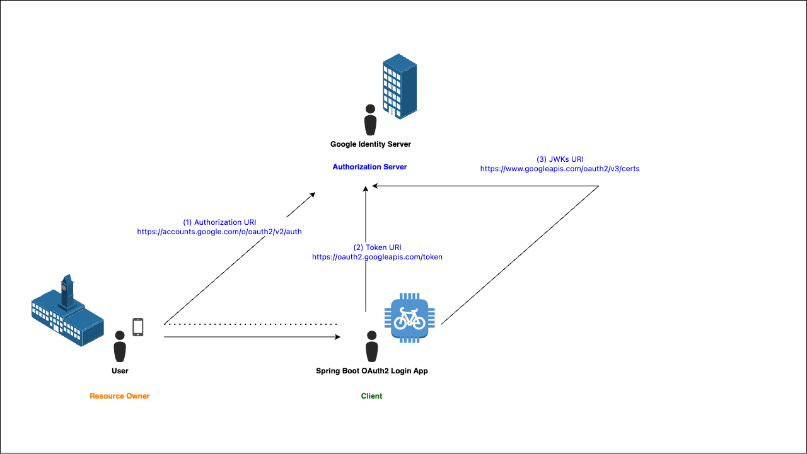
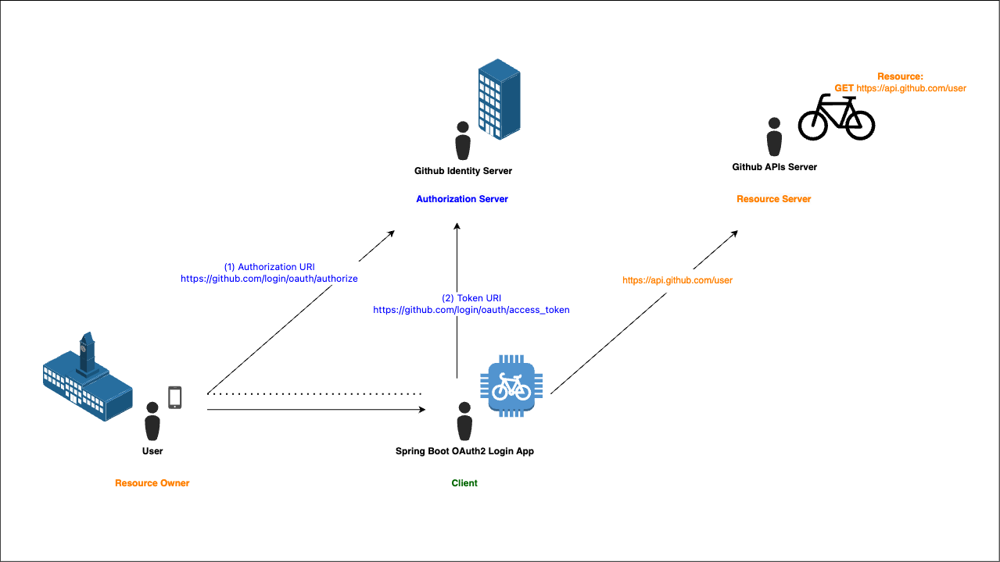

# Spring Security OAuth2 Login x Spring Boot 3

This project demonstrates how to implement OAuth2 authentication in a Spring Boot application using Spring Security OAuth2 Login feature with Authorization Code Grant flow running behind.

## Quick Start

1. Clone the repository
```bash
git clone https://github.com/nlinhvu/oauth-client-demo-2024
cd oauth-client-demo-2024
```

2. Configure Google Client ID credentials

3. Configure Github Client ID credentials

4. Set environment variables
```bash
export GOOGLE_CLIENT_ID=your_google_client_id
export GOOGLE_CLIENT_SECRET=your_google_client_secret

export GITHUB_CLIENT_ID=your_github_client_id
export GITHUB_CLIENT_SECRET=your_github_client_secret
```

5. Run the application
```bash
./gradlew bootRun
```

6. Visit http://localhost:8080

## Google OpenID Authorization Code Flow


## GitHub Authorization Code Flow


## References
- `1.` **OAuth 2.0 Login** in [**Spring Official Documentation**](https://docs.spring.io/spring-security/reference/servlet/oauth2/login/index.html).
- `2.` **OAuth 2.0 Login - Core Configuration** in [**Spring Official Documentation**](https://docs.spring.io/spring-security/reference/servlet/oauth2/login/core.html).
- `3.` **Google OpenID Connect** in [**Google Official Documentation**](https://developers.google.com/identity/openid-connect/openid-connect#java).
- `4.` **Creating an OAuth app** in [**Github Official Documentation**](https://docs.github.com/en/apps/oauth-apps/building-oauth-apps/creating-an-oauth-app).